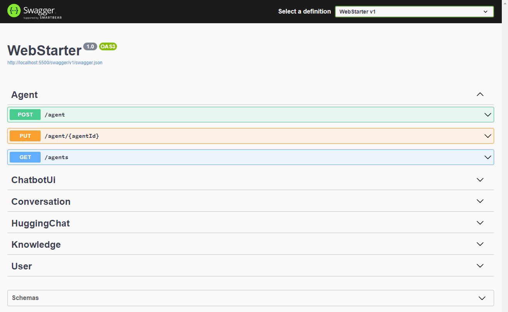
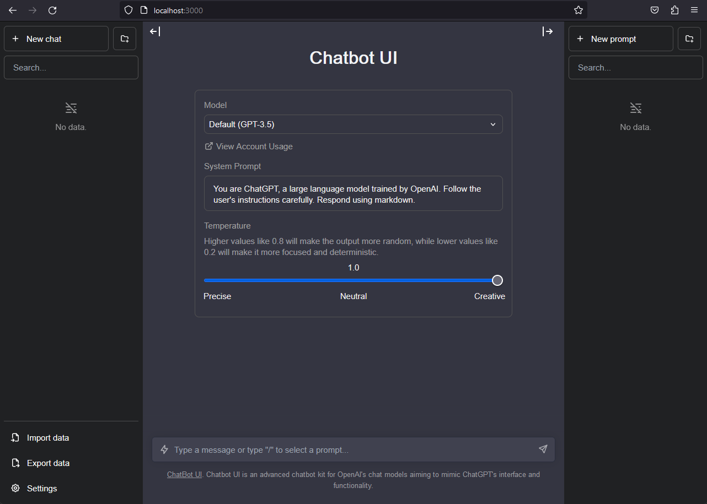

# Installation

BotSharp strictly follows the modular design principle and adopts a structure in which views and logic are separated. It also provides a complete Web API interface to integrate with your own system. At the architectural level, Hook and EvenT are designed for different purposes, which can expand Chatbot's dialogue capabilities without changing the kernel.

## Run locally in development mode

If you are a .NET developer and want to develop extensions or fix bug for BotSharp, you would hit F5 to run it locally in debug mode. 
Make sure the [Microsoft .NET SDK](https://dotnet.microsoft.com/en-us/download/dotnet/6.0) 6.0+ build environment
Building solution using dotnet CLI (preferred).

### Clone the source code and build
```powershell
PS D:\> git clone https://github.com/Oceania2018/BotSharp
PS D:\> cd BotSharp
PS D:\> dotnet build
```

### Update configuration
`BotSharp` can work with serveral LLM providers. Update `appsettings.json` in your project. Below config is tasking Azure OpenAI as the LLM backend

```json
"LlmProviders": [
  {
    "Provider": "azure-openai",
    "Models": [
      {
        "Name": "gpt-35-turbo",
        "ApiKey": "",
        "Endpoint": "https://gpt-35-turbo.openai.azure.com/",
        "Type": "chat",
        "PromptCost": 0.0015,
        "CompletionCost": 0.002
      },
      {
        "Name": "gpt-35-turbo-instruct",
        "ApiKey": "",
        "Endpoint": "https://gpt-35-turbo-instruct.openai.azure.com/",
        "Type": "text",
        "PromptCost": 0.0015,
        "CompletionCost": 0.002
      }
    ]
  }
]
```

### Run backend web project
```powershell
PS D:\> dotnet run --project src/WebStarter
```


### Open REST APIs 
You can access the APIs in browser through http://localhost:5500/swagger


### Test using the Postman
We have publicly shared the API collection of [Postman](https://www.postman.com/orange-flare-634868/workspace/botsharp/overview), which is convenient for developers to develop quickly.


So far, you have set up the Bot's running and development environment, but you can't actually test the Chatbot. The next step is about how to [Create an Agent](../agent/account) and start a conversation with the Chatbot.

**Ignore below section if you're going to just use REST API to interact with your bot.**

### Launch a chatbot UI (Optional)
You can use a third-party open source UI for debugging and development, or you can directly use the REST API to integrate with your system.
If you want to use the [Chatbot UI](https://github.com/mckaywrigley/chatbot-ui) as a front end.
```powershell
PS D:\> git clone https://github.com/mckaywrigley/chatbot-ui
PS D:\> cd chatbot-ui
PS D:\> cd npm i
PS D:\> cd npm run dev
```

Update API url in `.env.local` to your localhost BotSharp backend service.
```config
OPENAI_API_HOST=http://localhost:5500
```

Point your web browser at http://localhost:3000 and enjoy Chatbot with BotSharp.



## Install in NuGet
If you don't want to use the source code to experience this framework, you can also directly install the [NuGet packages](https://www.nuget.org/packages?q=BotSharp) released by BotSharp, and install different function packages according to the needs of your project. Before installing, please read the documentation carefully to understand the functions that different modules can provide.

```powershell
PS D:\> Install-Package BotSharp.Core
```